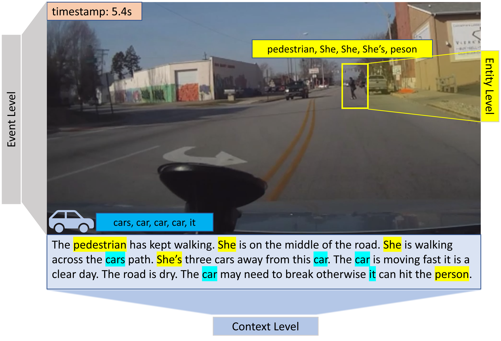

# Frequently Asked Questions (FAQ)

*[Q1]: Is there a limit on the team size for participating in the competition?*

**Reply:** No, there are no restrictions on the number of members allowed in each team. However, it is important to note that the winners will be recognized and awarded as a team at the conclusion of the competition.

---

*[Q2] Can driver prediction tasks use other inputs from the pedestrian intention prediction task (e.g., bounding box information)?*

**Reply:** Yes, you are free to explore any information you believe is useful to address the tasks, either provided in the PSI (e.g., intention) or beyond the PSI dataset (e.g., segment information). However, it is noteworthy that in the test stage, no ground-truth intention will be provided. Thus, one potential strategy is to estimate the intention for the test data and then use the prediction as additional knowledge for other tasks, such as driving decision prediction.

---

*[Q3]: Are we constrained to use certain libraries (like tensorflow or pytorch)?*

**Reply:** No, we don't constrain participants to use certain libraries. However, TensorFlow and PyTorch would be preferred. Please note that the winners (top 3) will be required to provide the code and detailed guidelines to help us validate and reproduce the results.

---

*[Q4]: The ‘main.py’ file does not run because there is inhomogeneous amount of data (‘description’ key in the data). How can we make this description homogenous in terms of dimension?* 

**Reply:** We have verified that the 'main.py' script of the baseline model functions correctly. However, it is important to note that the current baseline model does not incorporate the description data during the training process. To effectively utilize the textual information and ensure compatibility with the existing data dimensions, there are several strategies that can be employed.

One potential strategy is to extract text features using a pre-trained language model, such as BERT. By extracting features from the text, you can obtain representations with the same dimensions as the existing data. These extracted features can then be conveniently utilized to optimize your model. We are excitedly looking forward to the exploration of additional promising strategies in this challenge.

---

*[Q5]: Regarding CV_Annotations, what is the meaning of "keyframe" attribute inside skeleton?*

**Reply:** The keyframe attribute is added during the data annotation process but is not necessary when using the data. Please ignore that attribute.

We have realized that the posture data in the PSI 2 dataset has some issues and we plan to remove it from the competition dataset. All participants are still welcome to detect postures/key points using their algorithms, but ground-truth labels will no longer be provided.

To aid in the possible posture detection task, we have included the PSI 1 dataset as supplemental data in the competition. This dataset contains accurate posture labels for some of the cases. Feel free to use the PSI 1 data as needed to fine-tune any models.

---

*[Q6]: Regarding Cognitive_Annotations, what is the meaning of "selectedTextBbox" attribute?*

**Reply:** "selectedTextBbox" contains co-ordinates of bounding box corresponding to noun or pronouns in the text description. As shown in the attached image, all the words marked in “yellow” are linked with the same bounding box. Please note that this bounding box is different from the bounding box in the CV annotation with possibly different sizes, as they are annotated separately. 

One example of the object-level mapping:

Text Description: He is looking at the opposite side of the road. The “selectedTextBbox” attribute of the phrase “the road” is: "the road._relativeToGoalReasoningText_7": [465.32276330690826, 486.76056338028167, 1079.9546998867497, 621.4889336016097].

The key string has following 3 values based on underscore:
"the road." : Noun or pronoun.
"relativeToGoalReasoningText": Text Description containing the noun or pronoun
"7": Id of the bounding box

The remaining is the coordinates of the bounding box. 

---

*[Q7]: Regarding the evaluation and ground true, our understanding is that we have to create a ground-truth JSON file based on the training and validation sets. However, the annotations provided in the dataset correspond to several annotators (10-11). It means that we have to process all those annotations in order to create a ground-truth that provides a “1” or “0” pedestrian intention per frame. Something similar has to be done with the driver intention.  Does this ground-truth have to be generated using the mean (of all the annotators) or the majority strategy? Please, let us know if we are correctly interpreting how to create the JSON ground-truth.* 

**Reply:** For model training, we encourage participants to explore different strategies to leverage the multiple annotations provided by different annotators. However, for the validation and test data, we will use the majority vote annotation, determined by considering all annotators, as the ground truth to evaluate the submitted predictions. Based on our experience, disagreements among annotators have the potential to benefit model optimization and reduce overfitting.

---

*[Q8]: Test set, we understand that the test set will be released on August 31. We also understand that the test set will provide the video inputs together with the CV and Cognitive annotations (excluding the intentions). Are we interpreting things right?*

**Reply:** No, in the test data, only the CV annotations will be provided alongside the videos (clips). Cognitive annotations, which are closely linked to intent estimation, are intentionally excluded from the test data to avoid information leakage. This is because some sentences in the cognitive annotations explicitly include the intent, which could compromise the integrity of the evaluation. Additionally, in real-world applications, providing language descriptions at the initial stage is not practical. However, generating or predicting language descriptions based on visual input shows promise as a strategy.

---

*[Q9]: what is the meaning of "groudID" attribute inside '*objType*_track_*trackId*' in the CV annotations?*

**Reply:** We apologize for any confusion or inconvenience caused by this oversight. Regarding your question about the attribute "groupID," it was used solely for the purpose of collecting and organizing raw annotations for intent estimation. Consequently, the "groupID" attribute does not hold any relevance or provide any further information for the competition data processing or any specific tasks. Therefore, you can safely disregard any remaining "groupID" attributes present in the CV annotation files.

---
---
If you have any questions, please feel free to contact [psi.intent.benchmark@gmail.com](psi.intent.benchmark@gmail.com)
