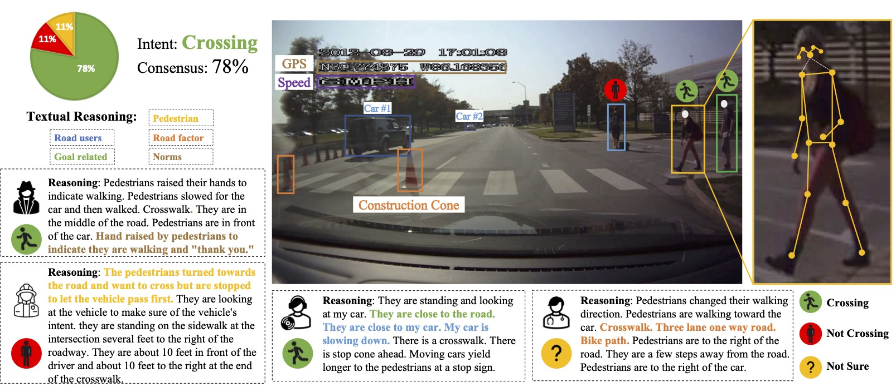

# WE are hosting the [IEEE ITSS Student Competition in Pedestrian Behavior Prediction](https://psi-intention2022.github.io) :trophy:. 

### :bookmark: News :
- 20230910: All PSI data including videos, CV annotations, and Cognitive Annotation (PSI1.0 & PSI 2.0) are public for download and future exploration! ~~[[Google Drive]()]~~ [[PSI Homepage](http://pedestriandataset.situated-intent.net)] :sparkler::zap:
- 20230830: Test data are released and a brief guidance is provided in [[Test Guidance](./test.md)].
- 20230624: Frequently asked questions are collected as [[FAQ](./FAQ.md)].
- 20230606: The official [[Homepage](https://psi-intention2022.github.io)], [[GitHub](https://github.com/PSI-Intention2022/PSI-Competition)], and [[CodaLab](https://codalab.lisn.upsaclay.fr/competitions/13808)] ([Track 1](https://codalab.lisn.upsaclay.fr/competitions/13808#phases), [Track 2](https://codalab.lisn.upsaclay.fr/competitions/13812?secret_key=7a566b48-693d-47cf-9de8-d43e6b6fa512#phases), and [Track 3](https://codalab.lisn.upsaclay.fr/competitions/13818?secret_key=bc6903e6-0a62-4df2-bb14-b31ae7b40a63#participate)) of the IEEE ITSS Student Competition are public.
---
The challenge has three tracks:
- :dart: [Pedestrian Intent Prediction (PIP)](https://github.com/PSI-Intention2022/PSI-Intent-Prediction.git)
- :dart: [Pedestrian Trajectory Prediction (PTP)](https://github.com/PSI-Intention2022/PSI-Trajectory-Prediction.git)
- :dart: [Driver Decision Prediction (DDP)](https://github.com/PSI-Intention2022/PSI-DriverDecision-Prediction.git)

The challenge is based on the [Pedestrian Situated Intent (PSI) 2.0](https://github.com/PSI-Intention2022/PSI-Dataset.git) dataset. 



## 1. Overview
Pedestrian behavior prediction poses a significant challenge for fully automated driving in urban environments, as it necessitates safe and efficient interaction between autonomous vehicles and pedestrians within dynamic and diverse surroundings. Ensuring the safety of pedestrians and autonomous vehicles alike relies heavily on accurate and reliable pedestrian behavior prediction.

## 2. Challenge Tracks

:dart:***Track 1 (Pedestrian Intent Prediction (PIP)):***  to predict the intention of a pedestrian crossing a street, such as whether they intend to cross or stop.

:dart:***Track 2 (Pedestrian Trajectory Prediction (PTP)):*** to predict the future trajectory of the pedestrian, given the pedestrian’s current position and intention.

:dart:***Track 3 (Driver Decision Prediction (DDP)):*** to predict the decision of the autonomous vehicle, given the pedestrian's intent and trajectory, to ensure safe and efficient interactions.

## 3. Qualification
We warmly invite participants from across the globe to join our competition. The primary participant must be a student, either at the graduate or undergraduate level. Each team is allowed to participate in multiple tracks. For further information, please visit the website provided below.


## 4. Prizes :trophy:
For each challenge track, cash prizes will be awarded to the top three winners as follows:

| Challenge Track | Gold :1st_place_medal: | Silver :2nd_place_medal: | Bronze :3rd_place_medal: |
| - | :- | :-: | :-: |
|***Track 1 (Pedestrian Intent Prediction (PIP))***| $ 2,000 | $ 1,000 | $ 500 |
|***Track 2 (Pedestrian Trajectory Prediction (PTP))***| $ 2,000 | $ 1,000 | $ 500 |
|***Track 3 (Driver Decision Prediction (DDP))***| $ 2,000 | $ 1,000 | $ 500 |


## 5. Timeline :hourglass_flowing_sand:
**Competition**: 
- [Preparing Date]: until 23:59 GMT, August 30, 2023 
- ***[Final Competition Date]: 00:00 - 23:59 UTC, August 30, 2023***
- [ITSC 2023 Workshop Time]: Sep. 24 - 28, 2023, Bilbao, Spain

***The winners are required to attend our ITSC Workshop either remotely or in person.***


## 6. Dataset - Pedestrian Situated Intent (PSI) 2.0

- Download and Prepare Dataset: Please follow [[Github](https://github.com/PSI-Intention2022/PSI-Dataset.git)] to prepare the PSI 2.0 dataset.
  - Training set: ready :white_check_mark: :smile:
  - Validation set: ready :white_check_mark: :smile:
  - Test set: ready :white_check_mark: :smile:

- Data Splits: The PSI 2.0 dataset is splitted into Train/Val/Test split as [./splits/PSI2_split.txt](./splits/PSI2_split.json).

## 7. Baselines 
To facilitate a quick start, we offer baselines for all challenge tracks, which serve as hints on utilizing the PSI 2.0 dataset effectively.

***Track 1 ([Pedestrian Intent Prediction (PIP)](https://github.com/PSI-Intention2022/PSI-Intent-Prediction.git))***: after observing 15 frames, equivalent to a duration of 0.5 seconds, the objective is to predict the intention of the target pedestrian crossing the road in front of the moving vehicle as either "Not Cross" or "Cross".

***Track 2 ([Pedestrian Trajectory Prediction (PTP)](https://github.com/PSI-Intention2022/PSI-Trajectory-Prediction.git))***: after observing 15 frames, which corresponds to a duration of 0.5 seconds, the task is to predict the trajectory of the target pedestrian for the subsequent time intervals of 0.5 seconds (15 frames), 1.0 second (30 frames), and 1.5 seconds (45 frames).

***Track 3 ([Driver Decision Prediction (DDP)](https://github.com/PSI-Intention2022/PSI-DriverDecision-Prediction.git))***: after observing 15 frames, encompassing a duration of 0.5 seconds, the goal is to predict the driving decision made by the driver. The prediction should consist of two outputs: **Speed** (options: 'increaseSpeed', 'decreaseSpeed', 'maintainSpeed') and **Direction** (options: 'goStraight', 'turnLeft', 'turnRight').


## 8.Evaluation :bellhop_bell:

### Evaluation Metrics
| Challenge Track | Reported Metrics | Ranking Metric | Ranking |
| - | :- | :-: | :-: |
|***Track 1 (Pedestrian Intent Prediction (PIP))***| F1, Recall, Precision | $F1$ | $\uparrow$|
|***Track 2 (Pedestrian Trajectory Prediction (PTP))***| ADE@1.5s <br> FDE@1.5s | $ADE@1.5s$| $\downarrow$|
|***Track 3 (Driver Decision Prediction (DDP))***| speed: Acc, mAcc <br> direction: Acc, mAcc | $\frac{(mAcc_{speed} + mAcc_{direction})}{2}$| $\uparrow$|

### Evaluation Scripts

***Track 1 (Pedestrian Intent):*** The evaluation ranking score is determined based on the F1-score of the binary intention prediction.
```python
cd ./evaluation_scripts/intention
python evaluate_results.py
```

***Track 2 (Pedestrian Trajectory):*** The evaluation ranking score for the competition is calculated as the average Average Displacement Error (ADE) of the predicted trajectory over a future time span of ***1.5*** seconds.
```python
cd ./evaluation_scripts/trajectory
python evaluate_results.py
```

***Track 3 (Driver Decision):*** The evaluation ranking score is computed as the average of the mean accuracy of both the speed and direction predictions.
```python
cd ./evaluation_scripts/driving_decision
python evaluate_results.py
```


## 9. Submission

### Submission Policy
Please participate the competition and submit results via CodaLab [[Track 1](https://codalab.lisn.upsaclay.fr/competitions/13808#phases)] [[Track 2](https://codalab.lisn.upsaclay.fr/competitions/13812?secret_key=7a566b48-693d-47cf-9de8-d43e6b6fa512#phases)] [[Track 3](https://codalab.lisn.upsaclay.fr/competitions/13818?secret_key=bc6903e6-0a62-4df2-bb14-b31ae7b40a63#participate)].

### Winners Validation
Winners will be expected to submit their code and trained weights for the validation process. Further information regarding the code submission process will be updated and provided in due course. 

### Submission Format
***Track 1 (Pedestrian Intent):*** Example intent ground-truth/prediction JSON format:
```
# Filename: val/test_intent_gt/intent_pred.json
video_name: {
    pedestrian_ID: {
        frame_ID: {
            intent: int # 0-not cross, 1-crossing
        }
    }
}
```

***Track 2 (Pedestrian Trajectory):*** Example trajectory ground-truth/prediction JSON format:
```
# Filename: val/test_traj_gt/traj_pred.json
video_name: {
    pedestrian_ID: {
        frame_ID: {
            traj/traj: {
                0: [xtl, ytl, xbr, ybr],
                1: [xtl, ytl, xbr, ybr],
                2: [xtl, ytl, xbr, ybr],
                ...
            }
        }
    }
}
```

***Track 3 (Driver Decision):*** Example driving decision ground-truth/prediction JSON format:
```
# Filename: val/test_driving_gt/driving_pred.json
video_name: {
    frame_ID: {
        speed: int, 
        direction: int
    }
}
```

## 10. Organizers
Faculty members: [Zhengming Ding](https://allanding.github.io), [Renran Tian](https://et.iupui.edu/people/rtian), [Yaobin Chen](http://et.engr.iupui.edu/~ychen/?_gl=1*15o01ly*_ga*MjA3NjEwMjYyNC4xNjg2MTk5MDAy*_ga_61CH0D2DQW*MTY4NjE5OTAwMS4xLjAuMTY4NjE5OTAwMS42MC4wLjA.)

Student members: [Taotao Jing](https://scottjingtt.github.io/about/), [Xin Hu](), [Zhengming Zhang]()

<!-- ## 11. Advisory Committee: 

(Coming soon ...) -->

## 11. Sponsorship

- IEEE Intelligent Transportation Systems Society
- Technical Committee on Human-Centered AI in Transportation (HAIT)

## 12. Questions & Contact
If you have any questions, please refer to the [FAQ](./FAQ.md) page, or feel free to contact [psi.intent.benchmark@gmail.com](psi.intent.benchmark@gmail.com)

## 13. Reference

[1] Chen, Tina, Taotao Jing, Renran Tian, Yaobin Chen, Joshua Domeyer, Heishiro Toyoda, Rini Sherony, and Zhengming Ding. "Psi: A pedestrian behavior dataset for socially intelligent autonomous car." arXiv preprint arXiv:2112.02604 (2021).

[2] Chen, Tina, Renran Tian, and Zhengming Ding. "Visual reasoning using graph convolutional networks for predicting pedestrian crossing intention." In Proceedings of the IEEE/CVF International Conference on Computer Vision, pp. 3103-3109. 2021.

[3] Jing, Taotao, Haifeng Xia, Renran Tian, Haoran Ding, Xiao Luo, Joshua Domeyer, Rini Sherony, and Zhengming Ding. "InAction: Interpretable action decision making for autonomous driving." In Computer Vision–ECCV 2022: 17th European Conference, Tel Aviv, Israel, October 23–27, 2022, Proceedings, Part XXXVIII, pp. 370-387. Cham: Springer Nature Switzerland, 2022.

[4] Zhang, Zhengming, Renran Tian, and Zhengming Ding. "TrEP: Transformer-based Evidential Prediction for Pedestrian Intention with Uncertainty." In Proceedings of the AAAI Conference on Artificial Intelligence, vol. 36, no. 3, pp. 3589-3597. 2022.
